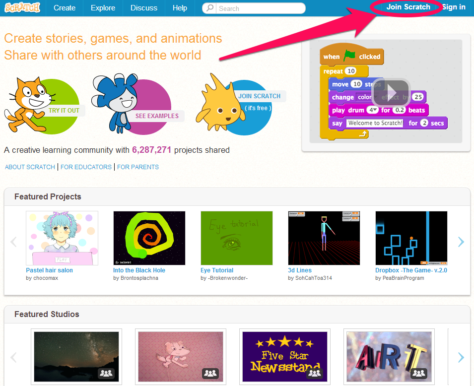

# Create a Scratch Account
### Go to <a href="http://scratch.mit.edu" target=new>Scratch</a> and click on "Join Scratch"

### Select a username and password.  

## Usernames
Edit this file and send a push request to add your name and username to the list below.
Add your username below using the format Last Name, First Name: Username

1) Kuehn, Michael: mkuehn10   
2) Student, Test: sahscode   
